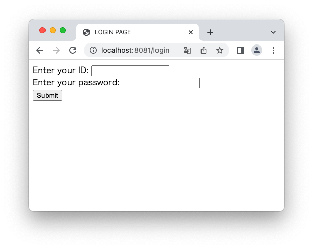

# statice
Implementation of session management using cookies by Go.

## Docker Version

```sh
> docker --version
Docker version 20.10.8, build 3967b7d
```

## Usage
Task: https://taskfile.dev/#/installation

### 1. Setup Docker-Container

```sh
# (= docker-compose up --build -d)
> task build  

# (= docker-compose exec front go run main.go)
> task rf 
```

### 2. Access `localhost:8081/login`



### 3. Enter ID and password
If you submit the correct ID and path, a SessionID will be generated and redirected to `/home`.  

- ID: `test-id`
- password: `test-password`

Even if you transition to `/login` after login, if sessionID is present in the cookie, you will be redirected to `/home.`  